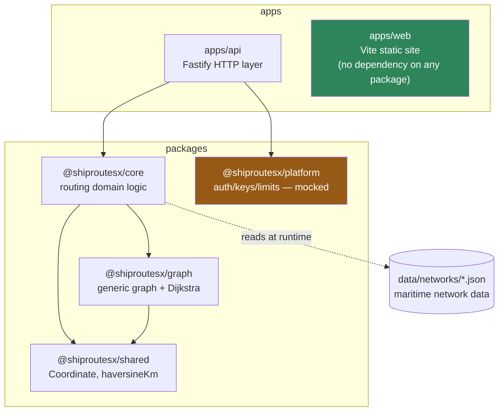
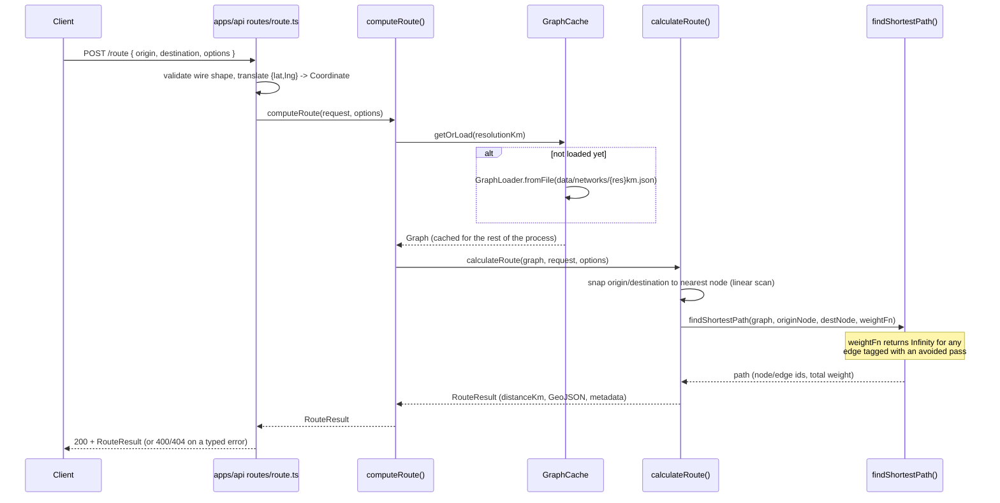

# Architecture

This document describes how **ShipRoutesX itself** is built. For the Java project that inspired it, see [`searoute-architecture-analysis.md`](searoute-architecture-analysis.md); for the (currently mocked) auth/billing layer, see [`platform-architecture.md`](platform-architecture.md).

## System overview

ShipRoutesX is an npm-workspaces monorepo: one Fastify API, one static marketing site, and four TypeScript packages with a strict, one-way dependency graph.



Two things about this graph are load-bearing, not incidental:

- **`packages/core`/`packages/graph` never import Fastify.** The routing engine is a plain TypeScript library; `apps/api` is the only place any HTTP framework appears. You could put a CLI or a different framework in front of the same engine without touching it.
- **`packages/platform` and the routing engine cannot see each other.** Neither has the other as a dependency. This is enforced by the dependency graph, not just a convention — see [`platform-architecture.md`](platform-architecture.md).

## Package responsibilities

| Package                 | Owns                                                                                                                                  | Does NOT own                                                                   |
| ----------------------- | ------------------------------------------------------------------------------------------------------------------------------------- | ------------------------------------------------------------------------------ |
| `@shiproutesx/shared`   | `Coordinate` type, `haversineKm` (great-circle distance)                                                                              | Anything maritime- or graph-specific                                           |
| `@shiproutesx/graph`    | `Node`/`Edge`/`Graph`, `GraphLoader` (validation), `GraphCache` (load-once-per-resolution), `findShortestPath` (binary-heap Dijkstra) | Maritime rules — no concept of "chokepoint" or "ship" anywhere in this package |
| `@shiproutesx/core`     | Network loading (`loadMaritimeGraph`), route computation (`calculateRoute`/`computeRoute`), `RouteOptions`, the error hierarchy       | HTTP, request/response shapes, wire formats                                    |
| `@shiproutesx/platform` | Interfaces + in-memory mocks for auth, API keys, rate limiting, usage tracking, developer accounts                                    | Anything routing-related; not wired into any request path yet                  |
| `apps/api`              | Translating HTTP ⇄ the engine's types, error-to-status-code mapping, startup orchestration                                            | Route computation itself — every route handler is a thin wrapper               |
| `apps/web`              | The marketing/landing page                                                                                                            | Everything else — it has zero runtime dependency on any package                |

## Request lifecycle: `POST /route`



The same split explains why there are two entry points in `@shiproutesx/core`:

- **`calculateRoute(graph, request, options)`** — pure, synchronous, no I/O. Takes an already-loaded `Graph`. This is what unit tests call directly with small fixture graphs.
- **`computeRoute(request, options)`** — async. Resolves _which_ resolution's graph to use, loads/caches it via `GraphCache`, then calls `calculateRoute`. This is what `apps/api` calls.

## Data model

A maritime network is a plain JSON file (`data/networks/{5,10,20,50,100}km.json` — currently only 20/50/100 exist):

```json
{
  "resolutionKm": 20,
  "nodes": [{ "id": "marseille", "lon": 5.3, "lat": 43.3 }],
  "edges": [
    { "id": "e4", "from": "marseille", "to": "piraeus", "distanceKm": 1653.3, "pass": null }
  ]
}
```

`GraphLoader` validates this shape (unique ids, no dangling edge references, positive distances) before building an immutable `Graph`. `Graph` precomputes an adjacency index at construction, so `incidentEdgeIds(nodeId)` is a map lookup, not a scan — this is the one caching/precomputation step that happens eagerly; everything else about a `Graph` is read-only after that.

An edge's optional `pass` field names the strait/canal/passage it transits (`"suez"`, `"panama"`, ...). `RouteOptions.avoid` blocks routes through named passes by turning the corresponding edges' weight to `Infinity` for that one request — the graph itself, and the Dijkstra implementation, are never modified or aware that "avoidance" is a maritime concept at all. This is the mechanism/policy split described above, made concrete.

## Key design decisions and why

| Decision                                                                                            | Why                                                                                                                                                                                                                                           |
| --------------------------------------------------------------------------------------------------- | --------------------------------------------------------------------------------------------------------------------------------------------------------------------------------------------------------------------------------------------- |
| One typed `RouteOptions` object, not a boolean per strait                                           | The Java project this is inspired by took 12 boolean parameters on `getRoute` — see [SeaRoute analysis §17.4](searoute-architecture-analysis.md). Adding a new option now means adding a field, not another parameter to every call site.     |
| A typed error hierarchy (`RouteValidationError` / `RouteNotFoundError` / `NetworkUnavailableError`) | Lets `apps/api` map each _kind_ of failure to the right HTTP status (400/404/400) without parsing error message text.                                                                                                                         |
| Binary-heap Dijkstra (`MinHeap`) instead of a linear scan for node selection                        | `O((V+E) log V)` instead of `O(V²)` — a real, tested algorithmic upgrade, not just a documented TODO.                                                                                                                                         |
| Nearest-node lookup is still a linear scan                                                          | Genuinely fine at the current network's size (tens of nodes). A spatial index is the natural next step once the real, larger SeaRoute-derived network replaces the starter data — tracked in the [Roadmap](../README.md#roadmap), not hidden. |
| `GraphCache` caches per resolution, never invalidates, never reloads                                | Matches "load once, cache in memory, immutable after loading." A failed load isn't cached, so a transient failure can be retried.                                                                                                             |
| `packages/platform` is a separate package with zero dependency either direction                     | The only way to make "the routing engine is unaware of authentication" a fact enforced by the type system, not a promise kept by discipline.                                                                                                  |

## What's intentionally not built yet

- **Antimeridian (±180°) handling** — routes crossing the international date line aren't stitched together specially yet.
- **A spatial index for nearest-node lookups** — see the table above.
- **The real SeaRoute-derived network** — today's `data/networks/*.json` is a small, hand-authored starter dataset (see [`data/README.md`](../data/README.md)), and all three resolution files currently hold identical data.
- **Real authentication, rate limiting, usage tracking, or billing** — see [`platform-architecture.md`](platform-architecture.md).
- **A serverless adapter for `apps/api`** — `apps/web` already deploys to Netlify; the API doesn't yet.

None of these are omissions discovered by accident — each is a deliberate, documented scope boundary. See the [Roadmap](../README.md#roadmap) for what's next.
