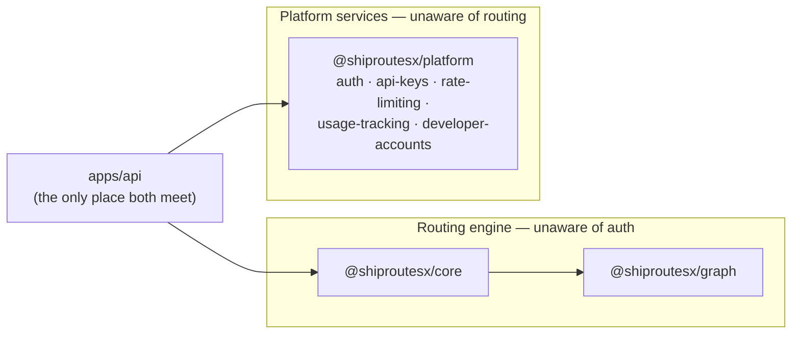
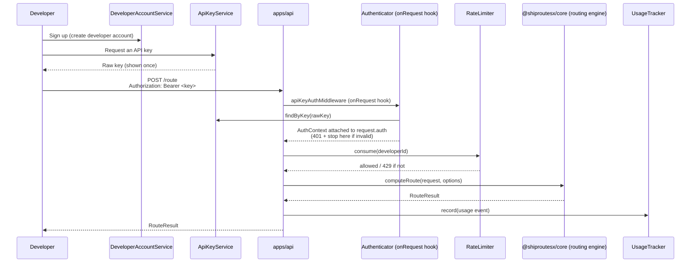

# ShipRoutesX as the first AIFlare platform API

ShipRoutesX is being prepared to become the first API inside the AIFlare platform — meaning it will eventually need real authentication, per-developer API keys, rate limiting, usage tracking, and developer accounts, shared concerns any future AIFlare API would also need.

**Status today: none of this is real yet.** `packages/platform` contains only interfaces and in-memory mock implementations. No middleware is registered. Every request to ShipRoutesX is unauthenticated. This document describes the _planned_ flow so the mocks, the disabled middleware location, and the eventual real implementation all agree on the same shape.

## Why a separate package

`packages/platform` has no dependency on `@shiproutesx/core` or `@shiproutesx/graph`, and neither of those depends on it. This isn't just a convention — it's enforced by the dependency graph: the routing engine physically cannot import anything from `packages/platform`, so it cannot become auth-aware by accident. `apps/api` is the only place both the routing engine and the platform layer are used together.



## The five modules (`packages/platform/src`)

| Module                  | Interface                 | Mock implementation                                                 | Real implementation will need                                                                            |
| ----------------------- | ------------------------- | ------------------------------------------------------------------- | -------------------------------------------------------------------------------------------------------- |
| `auth.ts`               | `Authenticator`           | `MockAuthenticator` — always authenticates, never rejects           | Hashed API-key lookup, expiry checks                                                                     |
| `api-keys.ts`           | `ApiKeyService`           | `MockApiKeyService` — in-memory, functionally real                  | A real datastore; hash secrets at rest, never store them raw                                             |
| `rate-limiting.ts`      | `RateLimiter`             | `MockRateLimiter` — real fixed-window logic, single-process only    | A shared store (e.g. Redis) so limits hold across multiple API instances                                 |
| `usage-tracking.ts`     | `UsageTracker`            | `MockUsageTracker` — in-memory event list                           | A real event store, retention policy, and aggregation (this API returns raw events, which doesn't scale) |
| `developer-accounts.ts` | `DeveloperAccountService` | `MockDeveloperAccountService` — in-memory, rejects duplicate emails | A real datastore; this is also where billing/plan changes would eventually hook in                       |

`MockAuthenticator` is deliberately the least "real" of the five: **authentication itself is explicitly not implemented** (that was a hard requirement of preparing this architecture — see the task this doc was written for). The other four mocks have genuinely correct in-memory logic (not just canned responses), because they aren't authentication and are useful to have working now for wiring and testing.

## The planned request flow, once enabled



Key point: **the routing engine step never touches auth, rate limiting, or usage tracking.** `computeRoute`/`calculateRoute` take a `RouteRequest`/`RouteOptions` and return a `RouteResult` — nothing about who's calling, whether they're rate-limited, or that the call will be logged is visible to it. All of that lives entirely in `apps/api`'s request lifecycle, wrapped around the engine, not inside it.

## Where the middleware location lives today

`apps/api/src/middleware/api-key-auth.ts` contains `apiKeyAuthMiddleware`, a complete Fastify `onRequest` hook implementing step 2 of the flow above (extract the bearer token, authenticate it, attach `request.auth`, or reply `401`). It is fully written and unit-tested (`api-key-auth.test.ts`, via a throwaway Fastify instance) — but **it is not registered** on the real app. `apps/api/src/app.ts` has a comment at the exact spot it would be added:

```ts
// Future: app.addHook('onRequest', apiKeyAuthMiddleware) — NOT enabled yet.
```

Enabling it later is a one-line change (`app.addHook('onRequest', apiKeyAuthMiddleware)`), once:

1. `MockAuthenticator` is replaced with a real implementation backed by `ApiKeyService`.
2. A decision is made about which routes require auth (likely everything except `GET /`, `GET /health`, and maybe `GET /graph/stats`).
3. Rate-limiting and usage-tracking hooks are written alongside it (not yet started — no prepared, disabled location exists for these two yet, unlike API-key auth).

## What's explicitly not decided yet

- Whether free-tier requests are rate-limited by developer account or by API key.
- Where real secrets/keys/usage data would actually be stored (Postgres? A managed auth provider? Not decided — the mocks are deliberately storage-agnostic).
- Whether unauthenticated access to any route remains supported once auth ships (today, everything is effectively "unauthenticated access" by default).

None of this blocks routing-engine work — that's the point of building the interfaces now, without wiring them in.
