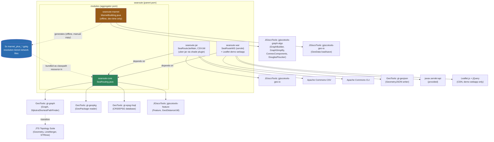

<!--
title: SeaRoute Deep-Dive — Architecture Analysis for ShipRoutesX
-->

# SeaRoute — Architecture Deep-Dive

**Source analyzed:** `searoute-master.zip` (Eurostat's [SeaRoute](https://github.com/eurostat/searoute), v3.7-SNAPSHOT)
**Purpose:** Full understanding pass before designing **ShipRoutesX**. No code was written or modified — this is documentation only.

---

## 1. Overall Architecture

SeaRoute is a **Java 9 / Maven multi-module** project with four modules sharing one parent POM:

```
searoute (parent pom, packaging=pom)
└── modules (aggregator pom)
    ├── core    → searoute-core   (jar)  — the routing ENGINE
    ├── marnet  → searoute-marnet (jar)  — offline NETWORK BUILDER (dev tool, not shipped at runtime)
    ├── jar     → searoute-jar    (jar, shaded/uber)  — CLI wrapper
    └── war     → searoute-war    (war)  — Servlet/REST wrapper + Leaflet demo page
```

It is fundamentally: **a small, static, pre-computed graph of maritime shipping lanes + Dijkstra's algorithm**, wrapped by three different delivery mechanisms (library, CLI, web service) that all call the exact same engine class. There is no database, no persistence layer beyond static files, and no framework (no Spring, no ORM) — everything is plain Java + GeoTools.

The actual "product" being versioned isn't really the code (~700 total lines across 5 classes) — it's the **5 pre-built maritime-network GeoPackage files** (`marnet_plus_{5,10,20,50,100}km.gpkg`), which encode the whole domain model as static geometry data.

---

## 2. Folder Structure

```
searoute-master/
├── pom.xml                              parent Maven POM
├── README.md                            usage docs (CLI, library, servlet)
├── doc/                                 images + doc pointer
└── modules/
    ├── pom.xml                          aggregator POM (core, marnet)
    ├── core/
    │   ├── pom.xml
    │   └── src/main/java/.../SeaRouting.java        ← THE routing engine
    │   └── src/main/resources/marnet/*.gpkg          ← 5 network files (bundled as classpath resources)
    │   └── src/test/java/.../SeaRoutingTest.java      ← known-route regression tests
    ├── marnet/
    │   ├── pom.xml
    │   └── src/main/java/.../MarnetBuilding.java     ← offline generalization pipeline
    │   └── src/main/resources/marnet.gpkg, pass.gpkg  ← RAW input data (source of truth)
    ├── jar/
    │   ├── pom.xml                       (maven-shade-plugin → uber jar)
    │   └── src/main/java/.../SeaRouteJarMain.java, CSVUtil.java
    │   └── release/searoute.zip           ← the actual GitHub release artifact (jar + .bat/.sh + gpkg + README)
    └── war/
        ├── pom.xml                        (maven-war-plugin, packaging=war)
        └── src/main/java/.../SeaRouteWS.java         ← HttpServlet ("REST" endpoint)
        └── src/main/webapp/               index.html, searoute.html (jQuery + Leaflet + Leaflet.Geodesic.js demo)
```

Note the **gpkg files are physically duplicated** three times (core/resources, jar/marnet, war/resources, plus release/) — there's no shared resource module; each consuming module just copies the same static files into its own resources.

---

## 3. Main Classes

| Class                                 | Module | Role                                                                                                                                                                                                                                                                                                                                               |
| ------------------------------------- | ------ | -------------------------------------------------------------------------------------------------------------------------------------------------------------------------------------------------------------------------------------------------------------------------------------------------------------------------------------------------- |
| **`SeaRouting`**                      | core   | The engine. Loads one GeoPackage resolution into an in-memory GeoTools `Graph`, exposes `getRoute(...)` / `getRoutes(...)`. Everything else is a thin wrapper around this.                                                                                                                                                                         |
| **`MarnetBuilding`**                  | marnet | Offline batch tool. Turns raw maritime-line data (`marnet.gpkg`) + strait/channel zones (`pass.gpkg`) into the 5 resolution-tiered network files, via a graph-generalization pipeline (planarize → line-merge → Douglas-Peucker simplify → dedupe → collapse short edges → keep largest connected component). Not part of the runtime path at all. |
| **`SeaRouteJarMain`** + **`CSVUtil`** | jar    | CLI entry point. Parses Apache-Commons-CLI flags, reads a CSV of O/D pairs, calls `SeaRouting`, writes a GeoJSON file.                                                                                                                                                                                                                             |
| **`SeaRouteWS`**                      | war    | `HttpServlet` exposing `GET/POST /seaws`. Keeps one `SeaRouting` instance **per resolution** (5 total) in a `HashMap`, built once in `init()`. Hand-builds JSON response strings.                                                                                                                                                                  |

All of these depend on an **external, not-included** Eurostat library, `eu.europa.ec.eurostat:jgiscotools-*` (feature model, geodesic distance math, generic geo I/O, and — only for `marnet` — the graph-generalization algorithms). This is a real external dependency pulled from Maven Central, not vendored code.

---

## 4. Entry Points

1. **As a library** — `new SeaRouting()` / `new SeaRouting(resKM)`, then `sr.getRoute(oLon, oLat, dLon, dLat)`. This is the README's primary documented usage and what everything else wraps.
2. **As a CLI** — `java -jar searoute.jar -i input.csv -o out.geojson -res 20 [-suez 0] [...]` → `SeaRouteJarMain.main()`. Distributed as `modules/jar/release/searoute.zip` (jar + `searoute.bat`/`searoute.sh` + sample CSV).
3. **As a web service** — deployed as a `.war` into Tomcat; `GET /searoute/seaws?ser=rou&opos=lon,lat&dpos=lon,lat&res=20&suez=1...` → `SeaRouteWS.doGet/doPost`.
4. **Offline data prep** (not a "runtime" entry point) — `MarnetBuilding.main()`, run manually by a maintainer (needs `-Xss8m`/`-Xss4m`, i.e. an enlarged stack, due to recursive graph algorithms) to regenerate the gpkg files whenever the raw maritime-line dataset changes.

---

## 5. Routing Algorithm

Per `SeaRouting` (`modules/core/.../SeaRouting.java`):

1. **Construction** (`new SeaRouting(resKM)`): loads the matching `marnet_plus_{res}km.gpkg` (classpath resource, falling back to `./marnet/...` on disk if not found), reads its single feature layer fully into memory via GeoTools' `FeatureGraphGenerator` + `LineStringGraphGenerator` — every `LineString` becomes graph edges, nodes are created/shared wherever coordinates coincide.
2. **Antimeridian stitching**: after the graph is built, every node sitting exactly on `x == 180` is manually linked with a zero-weight synthetic edge to its `x == -180` counterpart, so shortest paths can cross the date line.
3. **Per-request** (`getRoute(oLon, oLat, dLon, dLat, allowSuez, allowPanama, ...)`):
   - Find nearest graph node to the origin and destination points (`getNode`) — **linear scan over every node in the graph**, no spatial index.
   - **Shortcut heuristic**: if the straight-line O→D distance is _smaller_ than the distance needed to reach the network from both points, skip Dijkstra entirely and return a direct 2-point line (handles same-basin/local trips).
   - Otherwise, run GeoTools' `DijkstraShortestPathFinder` with a custom `EdgeWeighter`:
     - weight = geodesic length in km (`GeoDistanceUtil.getLengthGeoKM`)
     - **except** any edge whose `pass` attribute matches a _disallowed_ strait/channel → weight = `Double.MAX_VALUE` (effectively blocked)
     - the synthetic antimeridian edges (`e.getObject() == null`) always weight `0`
   - The whole Dijkstra call is wrapped in `synchronized(g)` — **a single global lock per graph/resolution**, serializing concurrent route requests.
   - Result: path edges are merged into one `MultiLineString` via JTS `LineMerger`, with two stub segments prepended/appended connecting the _actual_ O/D coordinates to their snapped network nodes.
   - Attributes returned: `distKM` (total route length), `dFromKM`/`dToKM` (length of the stub segments — a measure of snapping error/approximation).
4. **`getRoutes(ports, idProp, ...)`**: an all-pairs matrix helper — literally `O(n²/2)` independent calls to `getRoute`, no shared shortest-path-tree reuse across pairs.

**12 named passes** are supported as of v3.5: Suez, Panama, Malacca, Gibraltar, Dover, Bering, Magellan, Bab-el-Mandeb, Kiel, Corinth, Northwest Passage, Northeast Passage — each is just a string value on the `pass` attribute of relevant edges, toggled on/off per request via boolean flags.

---

## 6. How the Maritime Graph Is Stored

- **On disk**: GeoPackage (`.gpkg`, an OGC-standard SQLite container), one file per resolution tier (5/10/20/50/100 km), each with a single `LineString` layer + a `pass` string attribute.
- **Provenance**: derived from the _Oak Ridge National Labs Global Shipping Lane Network (2000)_, enriched with AIS-based lines around European coasts. The raw/authoritative source lives in `modules/marnet/src/main/resources/marnet.gpkg` (lines) + `pass.gpkg` (zones used to tag the `pass` attribute by spatial intersection) — these two files are the actual hand-maintained "source of truth"; the 5 per-resolution files are _build outputs_ of `MarnetBuilding`.
- **At runtime**: loaded **once, fully, into memory** as a GeoTools `Graph` object graph (Java `Node`/`Edge` instances holding JTS geometries) — see §9.
- File sizes (uncompressed gpkg): 100km ≈ 1.0 MB, 50km ≈ 1.5 MB, 20km ≈ 2.8 MB, 10km ≈ 4.6 MB, 5km ≈ 6.8 MB. The in-memory Java object graph is larger than these on-disk bytes.

---

## 7. How Ports Are Represented

There is **no `Port` class or bundled port dataset** in this repo at all. A "port" is just a generic `Feature` (from the external JGiscoTools library — a geometry + a `Map<String,Object>` attribute bag) that the _caller_ supplies:

- CLI: a row of a CSV with `olon/olat/dlon/dlat` columns (configurable column names).
- Servlet: raw `lon,lat` query-string values (`opos`/`dpos`).
- Library API: a raw `Coordinate` or a `Collection<Feature>` passed to `getRoutes(ports, idProp)`.

`SeaRouting.filterPorts(ports, minDistToNetworkKM)` is the one port-aware utility: it discards ports too far from any network node (i.e. "not really a coastal/maritime port"). Beyond that, ports are opaque to the engine — it only ever needs a coordinate.

---

## 8. Libraries Responsible for GIS Operations

| Library                                                                                                                | Role                                                                                                                                                                                                                                                                                                            |
| ---------------------------------------------------------------------------------------------------------------------- | --------------------------------------------------------------------------------------------------------------------------------------------------------------------------------------------------------------------------------------------------------------------------------------------------------------- |
| **GeoTools 26.1** (`gt-graph`, `gt-geopkg`, `gt-epsg-hsql`, `gt-geojson`)                                              | Graph data structure + `DijkstraShortestPathFinder` (`gt-graph`); GeoPackage reading (`gt-geopkg`); EPSG/CRS database via embedded HSQL (`gt-epsg-hsql`); GeoJSON geometry serialization (`gt-geojson`, war module only).                                                                                       |
| **JTS Topology Suite** (`org.locationtech.jts`, transitive via GeoTools)                                               | Core geometry types (`Coordinate`, `LineString`, `Point`, `Geometry`), `LineMerger` (stitches path edges into one line), `STRtree` (spatial index — used only in `MarnetBuilding`, **not** at query time in `SeaRouting`).                                                                                      |
| **JGiscoTools** (`eu.europa.ec.eurostat:jgiscotools-*` v0.9.21, external Eurostat library, source **not** in this zip) | `Feature` (geometry+attributes wrapper), `GeoDistanceUtil` (geodesic distance/length calculations), `GeoData` (generic multi-format load/save: gpkg/shp/geojson), and — marnet module only — `GraphBuilder`/`GraphSimplify`/`ConnexComponents`/`DouglasPeuckerRamerFilter` (network generalization algorithms). |

---

## 9. Where GeoJSON Output Is Generated

Two **independent, inconsistent** code paths:

- **CLI (`jar` module)**: `GeoData.save(features, outFile, crs)` — a generic external-library writer that infers format from the `.geojson` extension. Produces a full `FeatureCollection` with all original CSV columns plus `distKM`/`dFromKM`/`dToKM`.
- **Servlet (`war` module)**: `org.geotools.geojson.geom.GeometryJSON` serializes **just the `Geometry`** (not a Feature) into a `"geom"` field — and the _rest_ of the JSON envelope (`status`, `dist`, `dFrom`, `dTo`) is **hand-concatenated as raw strings**, not built through any JSON library. No escaping, no schema, no `FeatureCollection` wrapper.

---

## 10. Configuration Files

- `log4j2.properties` — one per module (core/jar/marnet/war), Log4j2 logging config.
- `pom.xml` × 6 (root, modules aggregator, core, marnet, jar, war) — the _only_ real configuration surface; there is no application config file (no yaml/json/properties for app behavior).
- `web.xml` — servlet-mapping only (`/seaws` → `SeaRouteWS`).
- All runtime tunables are **constructor arguments / CLI flags / HTTP query params** — there's no environment-based (dev/prod) profile system, no externalized network-file path config beyond the classpath→cwd fallback baked into `SeaRouting`'s constructor.

---

## 11. Build System

- **Maven**, multi-module, Java source/target level **1.9** (an unusually old, narrow target — effectively "Java 9 baseline", no newer language features used).
- `core` → plain jar, published to **Maven Central** as `searoute-core` (this is a real public library, not just internal code).
- `jar` → **maven-shade-plugin** uber-jar with a `Main-Class` manifest entry, packaged with wrapper scripts into `release/searoute.zip` — this is the actual GitHub release download.
- `war` → **maven-war-plugin**, targets Servlet 3.0 containers (Tomcat 7/8); a `tomcat7-maven-plugin` config exists for one-command deploy.
- `marnet` → no distinct packaged output; run ad hoc by a maintainer, its outputs (gpkg files) are manually copied into the other modules afterward.
- Full Sonatype OSSRH + GPG-signing release profile wired into the root POM — confirms this project's release process targets **public library distribution**, not an internal service pipeline.

---

## 12. External Dependencies (complete list)

- GeoTools 26.1 (`gt-graph`, `gt-geopkg`, `gt-epsg-hsql`, `gt-geojson`)
- JTS (transitive via GeoTools)
- JGiscoTools 0.9.21 (`jgiscotools-feature`, `jgiscotools-geo-io`, `jgiscotools-graph-algo`) — external, not vendored
- Apache Log4j2
- Apache Commons CLI 1.4 (jar module)
- Apache Commons CSV 1.8 (jar module)
- `javax.servlet-api` 3.1.0 (provided, war module)
- JUnit 4.13.1 (test scope, all modules)
- Frontend (war webapp demo only, all CDN, no bundler): jQuery 1.11.2, Leaflet 1.3.4, a vendored `Leaflet.Geodesic.js`

---

## 13. Performance Considerations

- **Startup cost dominates**: constructing a `SeaRouting` instance means fully parsing a GeoPackage and building an in-memory `Graph` — this is why `SeaRouteWS.init()` eagerly builds **all 5 resolutions once** at servlet startup and holds them for the container's lifetime, never per-request.
- **`getNode()` is O(N) per call** — a linear distance scan over _every_ node in the graph, for both origin and destination, on every single route request. No spatial index is used at query time (even though JTS `STRtree` is available and _is_ used elsewhere in the codebase, just not here). This is the single biggest algorithmic weak point — it gets worse as resolution gets finer (the 5km network has the most nodes).
- **No shared computation across an all-pairs matrix** — `getRoutes()` reruns Dijkstra from scratch for every one of the `n(n-1)/2` port pairs.
- **Global lock contention**: `synchronized(g)` around every Dijkstra call serializes _all_ concurrent routing requests sharing one resolution's graph — a single lock caps throughput regardless of available CPU cores.
- **Memory**: 5 graphs held simultaneously in the servlet (in-memory representation notably larger than the 1–7 MB on-disk gpkg sizes).
- **Dead code signals past awareness**: a commented-out LRU-style response cache in `SeaRouteWS` shows the original author already recognized repeated-computation cost as a problem, but it isn't active.
- **CLI batch mode is fully in-memory**: `SeaRouteJarMain` computes every row into an `ArrayList<Feature>` before one final `GeoData.save()` — no streaming, so very large CSV inputs load entirely into memory before any output is written.

---

## 14. Answers to the Assessment Questions

### 1. Could this be rewritten in TypeScript?

Yes — it's fundamentally a Dijkstra-over-a-static-graph problem plus geospatial I/O, nothing Java-exclusive. The gaps to fill: a GeoPackage reader (no mainstream JS equivalent to GeoTools — would need SQLite access + WKB geometry parsing, e.g. via `better-sqlite3`/`sql.js`), a geodesic-distance library (Turf.js covers this), a shortest-path graph library (`ngraph.path`/`ngraph.graph`, or a hand-rolled binary-heap Dijkstra), and JTS-equivalent line merging (Turf.js, or custom). The harder-to-port piece is `MarnetBuilding`'s generalization pipeline (planarize/simplify/dedupe/connected-components, all from JGiscoTools) — but since its _outputs_ are static pre-built files, the pragmatic path is to **reuse the existing gpkg files** (convert once, offline, to a TS-friendly format) rather than reimplementing the builder.

### 2. Which components are reusable?

- The **5 pre-built network files** — the actual domain-data asset, directly reusable (after a one-time format conversion).
- The **routing algorithm design** (snap-to-nearest-node → shortcut check → Dijkstra with pass-blocking → antimeridian stitch → stub-segment stitching) — a clean, language-agnostic spec.
- The **CLI contract** (CSV in → GeoJSON out, configurable column names, per-strait toggle flags).
- The **REST API shape** (`opos`/`dpos`/`res`/per-strait flags) as an interface design — though not its hand-built JSON string implementation.
- The **12 named passes/straits** as domain modeling.

### 3. Which components should be redesigned?

- `getNode()`'s linear scan → replace with a real spatial index (biggest single win).
- Hand-concatenated JSON strings in `SeaRouteWS` → a real JSON serializer with a defined schema.
- The global `synchronized(g)` lock → a read-only-graph concurrency model (trivial in TS: Node's request handling is single-threaded per event-loop turn anyway; worker-thread parallelism over an immutable shared graph is easy if needed).
- `getRoutes()`'s O(n²) all-pairs with no shared computation.
- The 12-boolean-parameter method signatures repeated across 4+ overloads → a single typed options object.
- The classpath-then-cwd resource-fallback trick, and the dead/commented-out code paths (cache, alternate CSV export) — drop, don't port.

### 4. Is the graph loaded into memory or queried as needed?

**Fully loaded into memory.** The GeoPackage is read once and completely at construction time, the datastore is `dispose()`d immediately after, and every subsequent operation (`getNode`, Dijkstra) works purely against the in-memory `Graph`. There is no on-demand/streaming/paged database access during routing.

### 5. Could this realistically become a REST API?

Yes — it effectively already is one (`SeaRouteWS` is a bare-bones REST-ish servlet). A modern rewrite (Express/Fastify/Nest) exposing `/route?from=...&to=...&res=...&avoid=...` returning a proper GeoJSON `Feature` is a straightforward modernization: same core logic, better input validation and real JSON output.

### 6. Could it eventually run in a serverless environment?

Yes, with an explicit strategy for the one real obstacle: **cold-start graph construction**. Mitigations: pre-serialize the parsed graph (skip re-parsing gpkg on every cold start), lazy-load only the requested resolution instead of eagerly loading all 5 like `SeaRouteWS` does, and rely on warm-container reuse (most serverless platforms already do this, so a module-level singleton still helps). Memory ceilings on small serverless tiers are the main thing to check against if multiple resolutions must coexist.

### 7. Which parts are tightly coupled to the original project?

- The hard dependency on **JGiscoTools** (external, Eurostat-internal, not in this repo) for `Feature`, `GeoData`, `GeoDistanceUtil`, and all generalization algorithms — the single biggest coupling to replace.
- GeoTools' particular `Graph`/`Node`/`Edge`/`DijkstraIterator` API shape (`.getObject()` casting patterns) — Java/GeoTools-idiomatic plumbing, not a portable design.
- The classpath-resource/cwd-fallback file-loading trick, tied to how the jar is packaged.
- Maven-specific release tooling (shade plugin, war packaging, Sonatype OSSRH + GPG, `tomcat7-maven-plugin`) — pure Java-ecosystem tooling, replaced wholesale by npm tooling in TS, not ported.
- EUPL-1.2 licensing / Eurostat maintainer metadata — organizational, not technical.

### 8. Which parts are generic maritime routing logic?

- The core algorithmic recipe: fixed maritime-lane graph → snap O/D to nearest lane node → Dijkstra over geodesic-km weights → blend in straight-line stubs to the real O/D points → optionally forbid edges tagged with a named chokepoint. Fully portable, language-independent.
- The **maritime lane network itself** (the gpkg data — real shipping lanes + named chokepoints) — generic geographic domain data.
- **Antimeridian stitching** — a generic requirement for any global routing graph, not specific to this codebase.
- The **direct-line shortcut heuristic** — a generic optimization for any similar routing problem.
- The **12 named straits/channels/passages** — generic maritime-geography domain knowledge.

---

## 15. Dependency Diagram



---

## 16. Flow Diagram: Route Request → GeoJSON

```mermaid
flowchart TD
    A["Client request<br/>(CLI: CSV row  /  Web: HTTP GET ?opos=..&dpos=..&res=..)"] --> B{"SeaRouting instance<br/>for requested resolution<br/>already built?"}
    B -->|"No (first use)"| C["Load marnet_plus_{res}km.gpkg<br/>via GeoTools GeoPkgDataStoreFactory"]
    C --> D["Read full feature layer into memory<br/>(SimpleFeatureCollection)"]
    D --> E["Build in-memory Graph<br/>(FeatureGraphGenerator + LineStringGraphGenerator)"]
    E --> F["Stitch antimeridian nodes<br/>(x=180 ↔ x=-180, zero-weight edges)"]
    F --> G["Dispose datastore<br/>(graph now fully in memory, DB no longer touched)"]
    B -->|Yes, cached instance| H
    G --> H["getRoute(oLon,oLat,dLon,dLat, allow-flags...)"]

    H --> I["getNode(origin), getNode(destination)<br/>— linear nearest-node scan over all graph nodes"]
    I --> J{"Straight-line O→D distance <br/>< distance needed to reach network?"}
    J -->|Yes| K["Return direct 2-point LineString<br/>(no Dijkstra needed)"]
    J -->|No| L["Build EdgeWeighter:<br/>weight = geodesic km,<br/>blocked passes → Double.MAX_VALUE"]
    L --> M["synchronized(graph):<br/>DijkstraShortestPathFinder.calculate()"]
    M --> N["Extract path edges"]
    N --> O["JTS LineMerger:<br/>merge path edges + O/D stub segments<br/>into one MultiLineString"]
    O --> P["Compute distKM / dFromKM / dToKM"]
    K --> Q
    P --> Q["Feature object<br/>(geometry + attributes)"]

    Q --> R{"Which entry point?"}
    R -->|CLI| S["Accumulate all rows into ArrayList&lt;Feature&gt;<br/>then GeoData.save(...) once at the end"]
    S --> T["out.geojson<br/>(FeatureCollection, external lib writer)"]
    R -->|Servlet| U["GeometryJSON.write(geometry) → 'geom' field<br/>+ hand-concatenated JSON string envelope"]
    U --> V["HTTP response body<br/>{status, dist, dFrom, dTo, geom}"]

    style K fill:#975a16,color:#fff
    style T fill:#2f855a,color:#fff
    style V fill:#2f855a,color:#fff
```



---

## 17. Recommendations for ShipRoutesX

A TypeScript project "inspired by" this architecture should **keep the algorithm, replace the plumbing**:

1. **Reuse the domain data, not the domain-data builder.** Convert the 5 existing `marnet_plus_*.gpkg` files once (offline, e.g. via `ogr2ogr` or a one-off script) into GeoJSON or a compact typed-array binary format. Don't attempt to port `MarnetBuilding`'s generalization pipeline into TS unless regenerating the network from raw AIS/shipping-lane data becomes an actual requirement — treat the network files as a versioned data asset, not a build step.

2. **Fix the two known weak points on day one**, since they're now-known, already-diagnosed issues rather than things to discover later:
   - A spatial index (e.g. `kdbush`, `rbush`, or a uniform grid) for nearest-node snapping instead of a linear scan.
   - No global lock: keep the graph immutable/read-only after load, so route computation is naturally safe to run concurrently (trivial under Node's single-threaded model; also safe to fan out across worker threads later).

3. **Package boundaries**, mirroring the original module split but cleaner:
   - `core` — pure routing logic (graph, Dijkstra/A*, edge weighting, pass-blocking, antimeridian stitching, direct-line shortcut). No I/O.
   - `network-data` — loading/parsing/caching the prebuilt network files; owns per-resolution lazy loading and the warm-instance cache (the one part of `SeaRouteWS.init()` worth keeping — just make it _lazy per resolution_, not eager for all 5).
   - `api` — HTTP layer (Express/Fastify/Nest), request validation, real GeoJSON `Feature`/`FeatureCollection` responses (not hand-built strings).
   - `cli` — CSV-in/GeoJSON-out batch mode, same contract as `SeaRouteJarMain`.

4. **Replace the 12-boolean-parameter signatures** with a single typed `RouteOptions` interface (`{ resolutionKm, avoid: Set<Pass> }`) — a natural fit for TS and removes an entire class of call-site bugs the original has (positional booleans, easy to transpose).

5. **Design for serverless from the start** as an explicit, named requirement (the original never had to think about this): lazy per-resolution loading, a pre-serialized graph format to skip GeoPackage parsing on cold start, and awareness of per-instance memory ceilings if more than one resolution might be warm at once.

6. **Port the regression-test _shape_, not the assertions**: `SeaRoutingTest`'s known city-pair + expected-distance-range tests are a cheap, valuable characterization-test pattern to carry over as-is once a TS engine exists to validate against.

7. **Things to deliberately leave behind**: the classpath/cwd resource-fallback trick, the commented-out LRU cache, the alternate dead CSV-export code path, and the hand-concatenated JSON string builder in `SeaRouteWS` — none of these are architecture worth preserving, just artifacts of the Java implementation.
